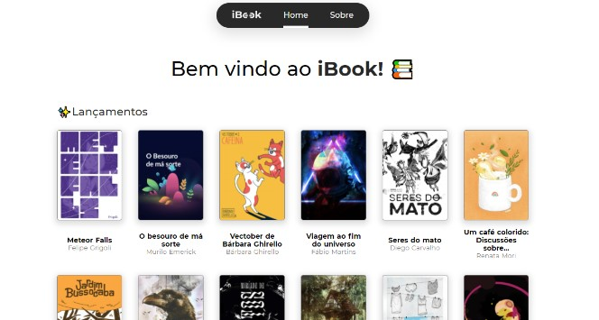

<!---->
<div align="center">

</div>

# Ibook - Leitor Online de e-books

<p>Esse projeto foi feito por: <strong>Thiago Silva Lopes</strong>, em 06/2021,</br>
tendo como base, as aulas de Escalando Vue com NuxtJs, no Bootcamp Full Stack da <a href="https://bootcamp.cataline.io/">Cataline</a>

## Demo:

##### Para instalar o projeto localmente, com a pasta "node_modules":

```
npm install
```

##### Para compilar/executar o projeto localmente:

```
npm run dev
```
